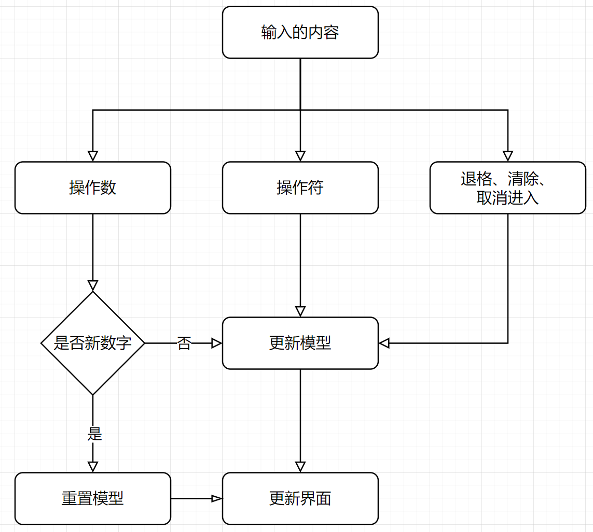
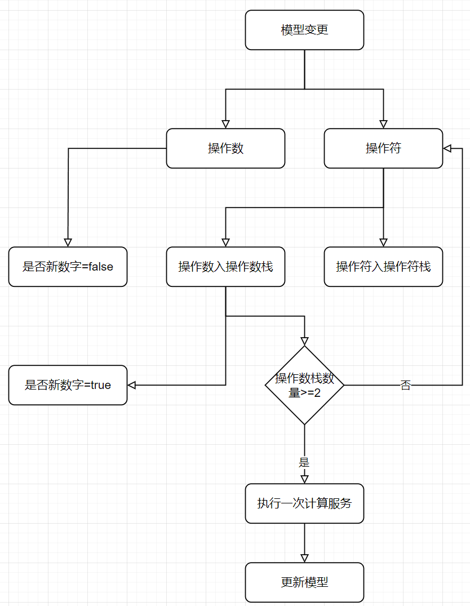

# CalculatorFx

## 流程设计图





## 模型对象

* input number：模型绑定，用户的输入可以变更此Model，程序计算可以变更此Model，此Model需要正则限定。

  ```java
  // 正则表达式：-?((0|[1-9][0-9]*)([.][0-9]*)?|[.][0-9]+)
  // 原正则表达式：[+-]?([0-9]+([.][0-9]*)?|[.][0-9]+)
  ```
  
* input operator：该Model仅用于接收单个操作符

* expression text：该Model用于展示表达式文本
